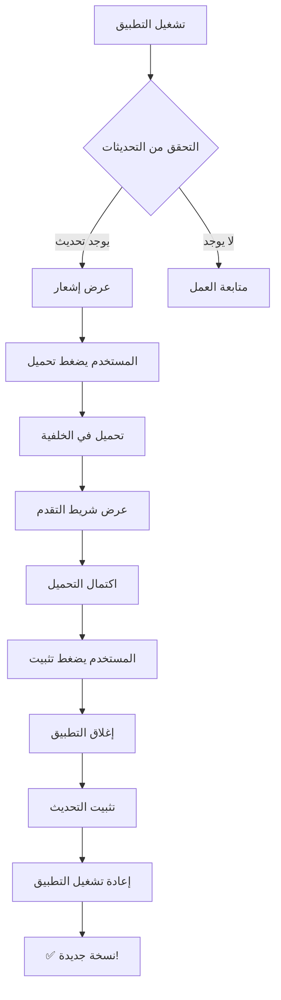

# 🔄 نظام التحديث التلقائي

## 📢 تم تطبيق نظام التحديث التلقائي بنجاح!

تطبيق BTP Maroc الآن يدعم التحديثات التلقائية مثل البرامج الاحترافية (VS Code, Discord, إلخ).

---

## 🎯 ماذا تم؟

تم تطبيق نظام تحديث تلقائي متكامل يعمل على:

### ✨ الميزات الرئيسية

| الميزة | الوصف | الحالة |
|--------|-------|--------|
| 🔍 **اكتشاف تلقائي** | يتحقق من التحديثات عند التشغيل | ✅ |
| 📢 **إشعار جميل** | واجهة عربية احترافية | ✅ |
| 📥 **تحميل ذكي** | في الخلفية مع شريط تقدم | ✅ |
| ⚡ **تثبيت سهل** | بنقرة واحدة | ✅ |
| 🔐 **أمان عالي** | تشفير وتحقق من التوقيعات | ✅ |

---

## 📚 الوثائق

### للبدء السريع
👉 **[دليل البدء السريع](docs/AUTO_UPDATE_QUICK_START.md)**  
خطوات سريعة لإعداد ونشر أول تحديث

### للفهم الشامل
📖 **[التوثيق الكامل](docs/AUTO_UPDATE_SYSTEM.md)**  
شرح تفصيلي لكل جزء من النظام

### للأمثلة العملية
💡 **[أمثلة الاستخدام](docs/AUTO_UPDATE_EXAMPLE.md)**  
سيناريوهات واقعية خطوة بخطوة

### للتحقق والاختبار
✅ **[قائمة التحقق](docs/AUTO_UPDATE_CHECKLIST.md)**  
تأكد من أن كل شيء معد بشكل صحيح

### الملخص الشامل
📋 **[الملف الكامل](docs/AUTO_UPDATE_COMPLETE.md)**  
نظرة شاملة على كل شيء

---

## 🚀 بدء سريع (3 خطوات)

### 1️⃣ الإعداد
```bash
# عدّل frontend-electron/package.json
{
  "build": {
    "publish": {
      "owner": "YOUR_GITHUB_USERNAME",  # ⚠️ غيّر هذا
      "repo": "YOUR_REPO_NAME"          # ⚠️ غيّر هذا
    }
  }
}
```

### 2️⃣ إعداد GitHub Token
```powershell
$env:GH_TOKEN="ghp_your_github_token_here"
```

### 3️⃣ النشر
```bash
cd frontend-electron
npm run release
```

**🎉 انتهى! التطبيق الآن يدعم التحديثات التلقائية**

---

## 📖 كيف يعمل؟



---

## 🎨 لقطات الشاشة

### الإشعار
```
╔═══════════════════════════════════╗
║  🔄  تحديث متاح                  ║
║      النسخة 1.0.1                ║
╠═══════════════════════════════════╣
║  ما الجديد:                      ║
║  • إصلاح مشاكل المزامنة          ║
║  • تحسين الأداء                  ║
║                                   ║
║  [ 📥 تحميل التحديث ]           ║
╚═══════════════════════════════════╝
```

### التحميل
```
╔═══════════════════════════════════╗
║  🔄  جاري تحميل التحديث...      ║
║      النسخة 1.0.1                ║
╠═══════════════════════════════════╣
║  جاري التحميل...          65%   ║
║  ████████████▓▓▓▓▓▓              ║
║  29 MB / 45 MB      1.2 MB/s    ║
╚═══════════════════════════════════╝
```

---

## 🔧 الملفات المضافة/المعدلة

<details>
<summary><b>👁️ اضغط لعرض قائمة الملفات</b></summary>

### Backend (Electron)
- ✏️ `frontend-electron/package.json`
- ✏️ `frontend-electron/src/main/index.ts`
- ✏️ `frontend-electron/src/main/preload.ts`
- ➕ `frontend-electron/dev-app-update.yml`

### Frontend (React)
- ➕ `frontend-web/src/types/electron.d.ts`
- ➕ `frontend-web/src/store/updateStore.ts`
- ➕ `frontend-web/src/hooks/useAutoUpdater.ts`
- ➕ `frontend-web/src/components/UpdateNotification/`
- ✏️ `frontend-web/src/App.tsx`

### Documentation
- ➕ `docs/AUTO_UPDATE_SYSTEM.md`
- ➕ `docs/AUTO_UPDATE_QUICK_START.md`
- ➕ `docs/AUTO_UPDATE_README.md`
- ➕ `docs/AUTO_UPDATE_EXAMPLE.md`
- ➕ `docs/AUTO_UPDATE_CHECKLIST.md`
- ➕ `docs/AUTO_UPDATE_COMPLETE.md`

### Configuration
- ✏️ `.gitignore`

</details>

---

## ⚡ أوامر مفيدة

```bash
# تطوير محلي
cd frontend-electron
npm run dev

# بناء فقط (بدون نشر)
npm run build:win

# بناء ونشر
npm run release

# أو بشكل صريح
npm run publish:win
```

---

## 🐛 حل المشاكل

| المشكلة | السبب المحتمل | الحل |
|---------|----------------|------|
| لا يظهر إشعار | لا يوجد إصدار أحدث | تأكد من رفع النسخة الجديدة |
| خطأ GitHub Token | Token غير مُعد | راجع [دليل الإعداد](docs/AUTO_UPDATE_QUICK_START.md#الخطوة-4-إعداد-المتغيرات-البيئية) |
| خطأ في التثبيت | نقص الصلاحيات | شغّل التطبيق كمسؤول |
| بطء التحميل | إنترنت بطيء | انتظر أو جرب لاحقاً |

---

## 📞 الدعم والمساعدة

- 📖 [الوثائق الكاملة](docs/)
- 🐛 [تقرير عن مشكلة](https://github.com/YOUR_USERNAME/btp-maroc-app/issues)
- 💬 تواصل مع فريق التطوير

---

## 🎓 تعلم المزيد

### الموارد الخارجية
- [electron-updater Documentation](https://www.electron.build/auto-update)
- [electron-builder Guide](https://www.electron.build/)
- [GitHub Releases Guide](https://docs.github.com/en/repositories/releasing-projects-on-github)

### فيديوهات تعليمية (مقترحة)
- كيفية إعداد GitHub Repository
- شرح نظام التحديث التلقائي
- أفضل الممارسات في النشر

---

## ✅ الحالة الحالية

| المكون | الحالة |
|--------|--------|
| Backend (Electron) | ✅ جاهز |
| Frontend (React) | ✅ جاهز |
| واجهة المستخدم | ✅ جاهزة |
| الوثائق | ✅ جاهزة |
| الاختبار | ⏳ جاهز للاختبار |

---

## 🎯 الخطوات التالية

1. [ ] إعداد GitHub Repository
2. [ ] إضافة GitHub Token
3. [ ] نشر الإصدار الأول (v1.0.0)
4. [ ] اختبار التطبيق
5. [ ] نشر تحديث تجريبي (v1.0.1)
6. [ ] اختبار نظام التحديث
7. [ ] النشر للمستخدمين النهائيين

---

## 🏆 الإنجازات

- ✅ نظام تحديث احترافي
- ✅ واجهة مستخدم عربية كاملة
- ✅ أمان وتشفير
- ✅ سهولة في الاستخدام
- ✅ وثائق شاملة

---

## 📝 الملاحظات النهائية

> **تذكير مهم**: لا تنسَ تغيير `YOUR_GITHUB_USERNAME` و `YOUR_REPO_NAME` في ملف `package.json`!

> **نصيحة أمنية**: لا تشارك GitHub Token مع أحد ولا تضعه في Git!

> **أفضل ممارسة**: اختبر التحديثات دائماً قبل النشر للمستخدمين النهائيين!

---

<div align="center">

### 🎉 مبروك! نظام التحديث التلقائي جاهز! 🎉

**صُنع بـ ❤️ لتطبيق BTP Maroc**

[]()
[]()
[]()

</div>

---

**التاريخ**: ديسمبر 2025  
**النسخة**: 1.0.0  
**الحالة**: ✅ جاهز للإنتاج
